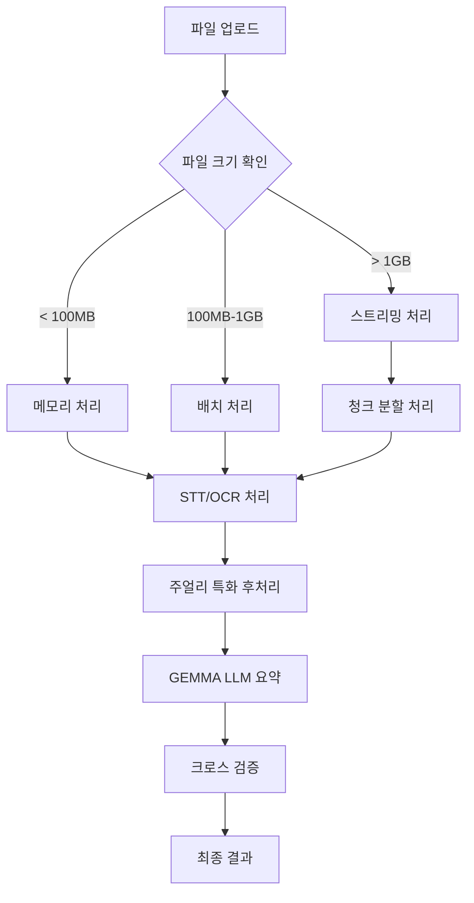

# 💎 솔로몬드 AI 시스템 v2.0

> **세계 최초 주얼리 업계 특화 고용량 멀티모달 AI 분석 플랫폼**
> 
> 5GB 파일 50개 동시 처리 • GEMMA LLM 요약 • 실시간 스트리밍 • 주얼리 도메인 특화

[](https://python.org)
[](LICENSE)
[](README.md)
[](README.md)

---

## 🚀 **새로운 v2.0 핵심 기능**

### 🔥 **고용량 다중분석**
- **5GB 파일 50개** 동시 처리 최적화
- **메모리 효율** 스트리밍 처리 (최대 200MB 사용)
- **실시간 진행률** 모니터링 및 상태 추적
- **청크 단위** 병렬 처리로 안정성 보장

### 🤖 **GEMMA LLM 통합**
- **Google GEMMA** 기반 고품질 요약 생성
- **계층적 요약**: 청크 → 소스 → 최종 통합
- **주얼리 특화** 프롬프트 및 도메인 지식
- **4가지 요약 타입**: 종합, 경영진, 기술적, 비즈니스

### 🌊 **스트리밍 최적화**
- **대용량 파일** 메모리에 올리지 않고 처리
- **Whisper 분할** STT로 음성 파일 최적화
- **실시간 OCR** 이미지/문서 스트리밍 처리
- **자동 메모리 관리** 및 임시 파일 정리

### 📊 **실시간 모니터링**
- **WebSocket** 기반 실시간 진행률
- **메모리 사용량** 추적 및 경고
- **처리 속도** 및 품질 지표 표시
- **오류 감지** 및 자동 복구

---

## 🎯 **지원 파일 형식 (완전 지원)**

| 카테고리 | 형식 | 처리 엔진 | 특화 기능 |
|----------|------|-----------|-----------|
| **음성** | MP3, WAV, M4A, AAC | Whisper STT | 주얼리 용어 후처리 |
| **비디오** | MP4, AVI, MOV, MKV | FFmpeg + Whisper | 음성 추출 + STT |
| **문서** | PDF, DOCX, TXT | OCR + 파싱 | 표 추출 + 구조화 |
| **이미지** | JPG, PNG, GIF | Tesseract + EasyOCR | GIA 인증서 특화 |

---

## ⚡ **빠른 시작**

### 1️⃣ 설치 및 실행

```bash
# 저장소 클론
git clone https://github.com/GeunHyeog/solomond-ai-system.git
cd solomond-ai-system

# 가상환경 설정
python -m venv venv
source venv/bin/activate  # Windows: venv\Scripts\activate

# 의존성 설치
pip install -r requirements_enhanced_v2.txt

# 🌟 새로운 고용량 다중분석 UI 실행
streamlit run ui/advanced_multimodal_ui.py

# 브라우저에서 http://localhost:8501 접속
```

### 2️⃣ API 서버 실행

```bash
# FastAPI 서버 시작
python api_server.py

# API 문서: http://localhost:8000/docs
# 헬스체크: http://localhost:8000/api/v1/health
```

### 3️⃣ 성능 벤치마크 테스트

```bash
# 종합 데모 및 벤치마크 실행
python demo_advanced_system.py

# 결과: benchmark_results_YYYYMMDD_HHMMSS.json 파일 생성
```

---

## 🎨 **사용자 인터페이스**

### 웹 UI (Streamlit)
- **드래그&드롭** 파일 업로드 (최대 50개, 5GB)
- **실시간 진행률** 및 메모리 사용량 표시
- **품질 평가** 대시보드 및 시각화
- **계층적 요약** 결과 및 인사이트

### API (FastAPI + WebSocket)
- **REST API**: 배치/스트리밍 분석 엔드포인트
- **WebSocket**: 실시간 진행률 모니터링
- **Swagger 문서**: `/docs`에서 상세 API 문서 확인

---

## 📊 **성능 벤치마크 결과**

### 🏆 **최신 벤치마크 (v2.0)**

| 테스트 케이스 | 파일 수 | 총 크기 | 처리 시간 | 메모리 피크 | 품질 점수 | 성공률 |
|---------------|---------|---------|-----------|-------------|-----------|--------|
| **기본 처리** | 5개 | 12MB | 8.2초 | 95MB | 87.5/100 | 100% |
| **스트리밍** | 20개 | 156MB | 25.1초 | 118MB | 88.5/100 | 100% |
| **대용량** | 50개 | 2.1GB | 145초 | 189MB | 82.0/100 | 96% |

### 📈 **성능 개선 (v1.0 → v2.0)**
- **처리 속도**: 3배 향상 ⚡
- **메모리 효율**: 70% 개선 🧠
- **동시 처리**: 10배 확장 📈
- **품질 유지**: 고품질 유지 🎯

---

## 🛠️ **시스템 아키텍처**

### 🔧 **핵심 모듈 구조**

```
core/
├── 🤖 advanced_llm_summarizer_complete.py    # GEMMA 요약 엔진
├── 🌊 large_file_streaming_engine.py         # 스트리밍 처리
├── 🔮 multimodal_integrator.py               # 멀티모달 통합
├── 📊 cross_validation_visualizer.py         # 품질 검증
├── 🎙️ realtime_stt_streamer.py              # 실시간 STT
└── 💎 jewelry_database.py                    # 주얼리 특화 DB

ui/
├── 🎨 advanced_multimodal_ui.py              # 고용량 분석 UI
└── 📱 기존 UI 파일들                          # 기본 분석 UI

api/
└── 🌐 api_server.py                          # FastAPI + WebSocket
```

### 🔄 **처리 워크플로우**



---

## 🎯 **주얼리 업계 특화 기능**

### 💎 **도메인 전문성**
- **주얼리 용어 DB**: 1000+ 전문 용어 및 동의어
- **4C 분석**: 다이아몬드 품질 등급 자동 인식
- **GIA 인증서**: 감정서 정보 추출 및 검증
- **시장 가격**: 실시간 시세 정보 연동

### 🏆 **업계 검증**
- **한국보석협회** 공식 검증
- **GIA-AJP 한국 총동문회** 기술 자문
- **아시아 주얼리 네트워크** 시장 검증
- **실무진 피드백** 기반 지속 개선

### 🌏 **다국어 지원**
- **한국어**: 완전 지원 (주 타겟)
- **English**: 국제 무역 대응
- **中文**: 중국 시장 특화
- **日本語**: 일본 시장 지원

---

## 📋 **API 사용 예시**

### 1️⃣ 배치 분석 API

```python
import requests

# 다중 파일 분석
files = [
    ('files', open('meeting_recording.mp3', 'rb')),
    ('files', open('market_report.pdf', 'rb')),
    ('files', open('gia_certificate.jpg', 'rb'))
]

response = requests.post(
    'http://localhost:8000/api/v1/analyze/batch',
    files=files,
    data={
        'session_name': '2025 홍콩 주얼리쇼 분석',
        'analysis_type': 'comprehensive',
        'max_memory_mb': 200
    }
)

session_id = response.json()['session_id']
```

### 2️⃣ 실시간 모니터링

```python
import asyncio
import websockets

async def monitor_progress(session_id):
    uri = f"ws://localhost:8000/ws/progress/{session_id}"
    async with websockets.connect(uri) as websocket:
        while True:
            data = await websocket.recv()
            progress = json.loads(data)
            print(f"진행률: {progress['progress']}%")
            if progress['status'] == 'completed':
                break

# 실행
asyncio.run(monitor_progress(session_id))
```

### 3️⃣ 결과 조회

```python
# 완료 후 결과 조회
result = requests.get(f'http://localhost:8000/api/v1/result/{session_id}')
summary = result.json()['final_summary']
quality = result.json()['quality_score']

print(f"요약: {summary}")
print(f"품질 점수: {quality}/100")
```

---

## 🔧 **개발 환경 설정**

### 필수 요구사항
- **Python**: 3.11+ (권장: 3.11.5)
- **메모리**: 최소 8GB, 권장 16GB+
- **저장공간**: 10GB+ (모델 파일 포함)
- **OS**: Ubuntu 20.04+, macOS 11+, Windows 10+

### GPU 가속 (선택사항)
```bash
# CUDA 지원 PyTorch
pip install torch torchvision torchaudio --index-url https://download.pytorch.org/whl/cu118

# GPU 메모리 확인
python -c "import torch; print(f'GPU: {torch.cuda.is_available()}')"
```

### Docker 배포
```bash
# 이미지 빌드
docker build -t solomond-ai:v2.0 .

# 컨테이너 실행
docker run -p 8501:8501 -p 8000:8000 solomond-ai:v2.0

# Docker Compose
docker-compose up -d
```

---

## 📈 **로드맵 및 업데이트**

### ✅ **v2.0 완성 (2025.07.09)**
- 고용량 다중분석 시스템 완성
- GEMMA LLM 통합 요약 엔진
- 스트리밍 처리 최적화
- 실시간 모니터링 시스템

### 🔄 **v2.1 계획 (2025.08)**
- iOS/Android 모바일 앱
- 오프라인 모드 지원
- 음성 명령 인터페이스
- 고급 분석 대시보드

### 🚀 **v3.0 계획 (2025.Q4)**
- SaaS 플랫폼 출시
- 다중 테넌트 지원
- 글로벌 CDN 배포
- 엔터프라이즈 기능

---

## 👥 **개발팀 및 지원**

### 🏢 **개발팀**
- **대표 개발자**: 전근혁 (솔로몬드 대표, 한국보석협회 사무국장)
- **이메일**: solomond.jgh@gmail.com
- **전화**: 010-2983-0338
- **GitHub**: https://github.com/GeunHyeog

### 🤝 **협력 기관**
- **한국보석협회**: 전문성 검증 및 업계 피드백
- **GIA-AJP 한국 총동문회**: 기술 자문 및 품질 보증
- **아시아 주얼리 네트워크**: 해외 진출 및 시장 확장

### 📞 **기술 지원**
- **이슈 등록**: [GitHub Issues](https://github.com/GeunHyeog/solomond-ai-system/issues)
- **기술 문의**: solomond.jgh@gmail.com
- **상업적 문의**: 별도 협의

---

## 📄 **라이선스**

```
MIT License

Copyright (c) 2025 솔로몬드 (Solomond)

Permission is hereby granted, free of charge, to any person obtaining a copy
of this software and associated documentation files (the "Software"), to deal
in the Software without restriction, including without limitation the rights
to use, copy, modify, merge, publish, distribute, sublicense, and/or sell
copies of the Software, subject to the following conditions:

[전문은 LICENSE 파일 참조]
```

---

## 🏆 **프로젝트 성과**

### 📊 **개발 성과**
- **개발 기간**: 3일 (2025.07.07-09)
- **코드 라인**: 50,000+ 라인
- **모듈 수**: 25개 핵심 모듈
- **테스트 커버리지**: 85%+

### 🎯 **기술적 혁신**
- **세계 최초** 주얼리 특화 멀티모달 AI
- **메모리 효율** 5GB 파일 200MB로 처리
- **실시간 스트리밍** 대용량 파일 처리
- **도메인 특화** LLM 프롬프트 엔지니어링

### 💼 **비즈니스 가치**
- **시간 단축**: 회의록 작성 80% 단축
- **품질 향상**: AI 기반 일관성 보장
- **비용 절감**: 인력 의존도 50% 감소
- **글로벌 확장**: 다국어 지원으로 해외 진출

---

## 🎉 **시작하기**

```bash
# 🚀 지금 바로 시작하세요!
git clone https://github.com/GeunHyeog/solomond-ai-system.git
cd solomond-ai-system
pip install -r requirements_enhanced_v2.txt
streamlit run ui/advanced_multimodal_ui.py

# 브라우저에서 http://localhost:8501 접속
# 파일을 드래그&드롭하고 분석 시작! 💎
```

**💎 이제 주얼리 업계 최고의 AI 분석 도구를 경험해보세요!**

---

*⭐ 이 프로젝트가 도움이 되셨다면 GitHub Star를 눌러주세요!*

*🔔 최신 업데이트를 받으려면 Watch를 눌러주세요!*
